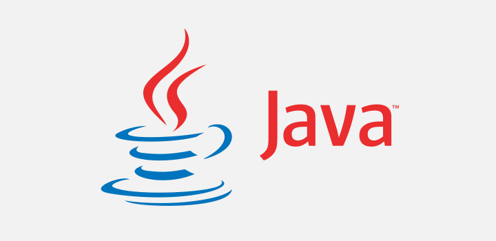

# 👋 Hola mucho gusto.
Me llamo Luz Tovar, soy estudiante de Ingenieria de Sistemas Computacionales. El conocer esta carrera fue increible para mi por que ahora me encanta el mundo de la tecnología y todo lo increible que podemos crear.

* Me gusta mantenerme en constante aprendizaje.
* Estoy interesada en temas de Ingenieria de Software, Bases de datos, Desarrollo Web y Redes.
* Actualmente estoy aprendiendo Back-End, para ser un Developer Full Stack en "Innovaccion Virtual".
* Me considero autodidacta, me gusta aprender y lo mejor de esto es poder comartirlo.
* Me gusta hechar a valar mi creatividad.

## Lenguajes y Herramientas
-----

            
            
            
            
            
            
            
            
            

------
No solo soy un estudiante de ingenieria, si no tambien me gusta conocer nuevos lugares y la repostrería.
